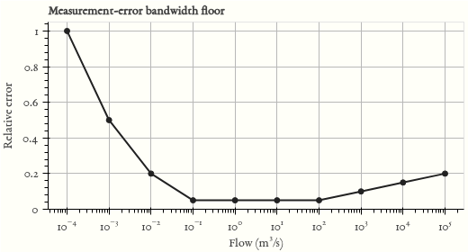

# Fixed-bandwidth vs. adaptive-bandwidth KDE for flow duration curves

Jump to [Reproducing the results](#reproducing-the-results).

## Background

The kernel bandwidth is a hyperparameter that governs smoothing of the
marginal density of finite observations. The optimality of a fixed
(“plug-in”) kernel bandwidth estimator has been documented on the basis
of a Gaussian parametric assumption on the curvature of the pdf
$`\int f''(x) dx`$.

We propose setting the bandwidth as a function of measurement
uncertainty, using the heteroscedastic precision floor of daily
streamflow records as prior knowledge. We demonstrate the approach on
the [Caravan](https://caravan-hydrology.github.io/) large-sample dataset
([<span class="nocase">Kratzert et al.</span>
2023](#ref-kratzert2023caravan), [2025](#ref-kratzert_2025_caravancsv)),
comparing flow duration curves
([**foster1934duration?**](#ref-foster1934duration); [Vogel and
Fennessey 1994](#ref-vogel1994flow)) estimated with the fixed (FB) and
adaptive (AB) methods across geographically distinct regions.

Both methods assume a Gaussian kernel:

``` math
f(x) = \frac{1}{N} \sum_{i=1}^{N} \frac{1}{h \sqrt{2 \pi}} \exp \left( \frac{-(x - x_i)^2}{2h^2} \right)
```

The Silverman ([2018](#ref-silverman2018density)) rule-of-thumb
bandwidth is:

``` math
\hat{h} = 1.06 \min(\hat{\sigma},\, \text{IQR}) \, N^{-1/5}
```

where $`\hat{\sigma}`$ is the sample standard deviation, IQR is the
interquartile range, and $`N`$ is the sample size.

The adaptive bandwidth uses a piecewise linear measurement error model
to set a per-observation bandwidth floor. The error model is shown
below:

<figure>

<figcaption aria-hidden="true">An approximate error model for daily
streamflows</figcaption>
</figure>

Both the error function and the minimum flow threshold are site-specific
assumptions. Probabilistic rating curves, when available, could replace
the empirical model used here.

## Methodology

1.  Compute the global unit area runoff (UAR) range
    $`[\text{UAR}_\text{min},\, \text{UAR}_\text{max}]`$ across all
    stations in the region.
2.  Extract unique flow values per station to define the sample support.
3.  Exclude stations with a single unique value or fewer than one
    complete hydrological year.
4.  Apply the piecewise error model to each unique value $`q`$,
    returning relative error $`\varepsilon(q)`$.
5.  Compute the bandwidth floor in log space:
    $`b_{\text{floor}} = \log(1 + \varepsilon)`$.
6.  Compute log-space Voronoi half-widths $`\Delta_i`$ between adjacent
    unique values.
7.  Set the per-observation bandwidth:
    $`h_i = \max(\Delta_i,\, b_{\text{floor},i})`$.
8.  Assign each observation its bandwidth by index lookup in the sorted
    unique-value array.

The result is a vector $`\mathbf{h}`$, one bandwidth per observation,
used as the standard deviation of the Gaussian kernel centred on
$`\log(u_i)`$.

9.  Select bin count $`M`$ such that quantization error is near the 5%
    nominal measurement error. For the evaluated sample, 256 bins
    (8-bit) over the global UAR range yields approximately 4% error.
10. Log-transform all observations: $`z_i = \log(u_i)`$.
11. Evaluate the adaptive KDE on the log-space grid:

``` math
\hat{f}(z) = \frac{1}{N} \sum_{i=1}^{N} \frac{1}{h_i \sqrt{2\pi}} \exp\!\left(\frac{-(z - z_i)^2}{2 h_i^2}\right)
```

12. Convert the PDF to a PMF: $`p_j = \hat{f}(z_j) \cdot w_j`$, then
    normalize so $`\sum_j p_j = 1`$.

The Silverman estimator uses
[KDEpy](https://kdepy.readthedocs.io/en/latest/)
([<span class="nocase">Tommy et al.</span> 2023](#ref-kdepy2023)), which
evaluates the kernel via FFT convolution in $`O(n \log n)`$.

Divergence between the two estimators is measured with the
Kolmogorov-Smirnov (KS) statistic: the maximum absolute difference
between the two CDFs over their shared support.

## Data

The analysis covers six regional subsets drawn from the
[Caravan](https://caravan-hydrology.github.io/) large-sample hydrology
dataset ([<span class="nocase">Kratzert et al.</span>
2023](#ref-kratzert2023caravan), [2025](#ref-kratzert_2025_caravancsv)):

| Region | Subset | Reference |
|----|----|----|
| Australia | CAMELS-AUS | Fowler et al. ([2021](#ref-fowler2021camels)) |
| Brazil | CAMELS-BR | Chagas et al. ([2020](#ref-chagas2020camels)) |
| Chile | CAMELS-CL | <span class="nocase">Alvarez-Garreton et al.</span> ([2018](#ref-alvarez2018camels)) |
| Great Britain | CAMELS-GB | <span class="nocase">Coxon et al.</span> ([2020](#ref-coxon2020camels)) |
| North America | HYSETS | Arsenault et al. ([2020](#ref-arsenault2020comprehensive)) |
| Central Europe | LaMAH-CE | Klingler et al. ([2021](#ref-klingler2021lamah)) |

Download the Caravan dataset from
[huggingface.co/datasets/kratzert/Caravan](https://huggingface.co/datasets/kratzert/Caravan).
Set `Config.caravan_dir` in `scripts/config.py` to the local path of the
extracted `Caravan-csv` folder before running any scripts. The folder
must contain an `attributes/` subdirectory and a `timeseries/csv/`
subdirectory, both organized by region.

## Reproducing the results

1.  Clone the repository.
2.  Create a virtual environment and install dependencies (`uv`
    recommended):

``` bash
uv venv
uv pip install -r requirements.txt
```

3.  Set `Config.caravan_dir` in `scripts/config.py` to the local path of
    the Caravan dataset.

4.  Run preprocessing to compute reference distributions:

``` bash
python scripts/preprocess.py [region|index|all]
```

Outputs written to `data/baseline_distributions/{region}/{N}_bits/`: -
`pmf_obs.csv`: observed empirical PMF - `pmf_kde_adaptive.csv`:
adaptive-bandwidth KDE PMF - `pmf_kde_silverman.csv`: Silverman KDE
PMF - `pmf_lnmle.csv`: log-normal MLE PMF

Outputs written to `cache/{region}/`: - `complete_year_stats.parquet`:
complete Oct-Sep hydrological years per station -
`station_meta.parquet`: station metadata filtered by record length and
UAR bounds - `weibull_quantiles.parquet`: empirical ECDF quantiles for
dip-test input

5.  Run the analysis to compute per-station divergence scores:

``` bash
python scripts/run_analysis.py [region|index|all]
```

Outputs written to `cache/`: - `{region}_kde_comparison.parquet`:
per-station KS, $`W_1`$, ED, ISD, and KL scores at 6, 8, and 10 bits -
`{region}_worst10_pmfs.parquet`: PMF data for the 10 worst-case stations
per metric at 8 bits - `{region}_median_pmfs.parquet`: PMF data for 8
median stations per metric at 8 bits -
`{region}_bin_concentration.parquet`: top-bin mass fraction statistics
per station

6.  Build the interactive HTML report:

``` bash
python scripts/build_report.py [region|index|all]
```

Output: `scripts/max_kde_diffs.html`

## Notes

[README.md](README.md) is generated from [README.src.md](README.src.md)
using [Pandoc](https://pandoc.org/) with `citeproc`. To update the
rendered README after editing the source:

``` bash
make readme
```

Citation keys in `README.src.md` follow Pandoc’s `[@key]` syntax. The
bibliography is maintained in [references.bib](references.bib). To add a
reference, add the BibTeX entry to `references.bib` and insert the
citation key in `README.src.md`, then re-run `make readme`.

## References

<div id="refs" class="references csl-bib-body hanging-indent">

<div id="ref-alvarez2018camels" class="csl-entry">

<span class="nocase">Alvarez-Garreton, Camila, Pablo A Mendoza, Juan
Pablo Boisier, et al.</span> 2018. “The CAMELS-CL Dataset: Catchment
Attributes and Meteorology for Large Sample Studies–Chile Dataset.”
*Hydrology and Earth System Sciences* 22 (11): 5817–46.

</div>

<div id="ref-arsenault2020comprehensive" class="csl-entry">

Arsenault, Richard, François Brissette, Jean-Luc Martel, et al. 2020. “A
Comprehensive, Multisource Database for Hydrometeorological Modeling of
14,425 North American Watersheds.” *Scientific Data* 7 (1): 1–12.

</div>

<div id="ref-chagas2020camels" class="csl-entry">

Chagas, Vinı́cius BP, Pedro LB Chaffe, Nans Addor, et al. 2020.
“CAMELS-BR: Hydrometeorological Time Series and Landscape Attributes for
897 Catchments in Brazil.” *Earth System Science Data* 12 (3): 2075–96.

</div>

<div id="ref-coxon2020camels" class="csl-entry">

<span class="nocase">Coxon, Gemma, Nans Addor, John P Bloomfield, et
al.</span> 2020. “CAMELS-GB: Hydrometeorological Time Series and
Landscape Attributes for 671 Catchments in Great Britain.” *Earth System
Science Data* 12 (4): 2459–83.

</div>

<div id="ref-fowler2021camels" class="csl-entry">

Fowler, Keirnan JA, Suwash Chandra Acharya, Nans Addor, Chihchung Chou,
and Murray C Peel. 2021. “CAMELS-AUS: Hydrometeorological Time Series
and Landscape Attributes for 222 Catchments in Australia.” *Earth System
Science Data* 13 (8): 3847–67.

</div>

<div id="ref-klingler2021lamah" class="csl-entry">

Klingler, Christoph, Karsten Schulz, and Mathew Herrnegger. 2021.
“LamaH-CE: LArge-SaMple DAta for Hydrology and Environmental Sciences
for Central Europe.” *Earth System Science Data* 13 (9): 4529–65.

</div>

<div id="ref-kratzert2023caravan" class="csl-entry">

<span class="nocase">Kratzert, Frederik, Grey Nearing, Nans Addor, et
al.</span> 2023. “Caravan-a Global Community Dataset for Large-Sample
Hydrology.” *Scientific Data* 10 (1): 61.

</div>

<div id="ref-kratzert_2025_caravancsv" class="csl-entry">

Kratzert, Frederik, Grey Nearing, Nans Addor, et al. 2025. *Caravan – a
Global Community Dataset for Large-Sample Hydrology (Csv Version)*.
Version 1.6. Zenodo. <https://doi.org/10.5281/zenodo.15530022>.

</div>

<div id="ref-silverman2018density" class="csl-entry">

Silverman, Bernard W. 2018. *Density Estimation for Statistics and Data
Analysis*. Routledge.

</div>

<div id="ref-kdepy2023" class="csl-entry">

<span class="nocase">Tommy, Scott White, Alexandra, Riccardo Di Maio,
gunvor, and Luke Dyer</span>. 2023. *Tommyod/KDEpy: V1.1.8*. V. v1.1.8.
Zenodo, released October. <https://doi.org/10.5281/zenodo.8422073>.

</div>

<div id="ref-vogel1994flow" class="csl-entry">

Vogel, Richard M, and Neil M Fennessey. 1994. “Flow-Duration Curves. I:
New Interpretation and Confidence Intervals.” *Journal of Water
Resources Planning and Management* 120 (4): 485–504.

</div>

</div>
